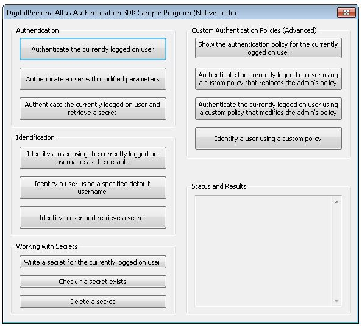
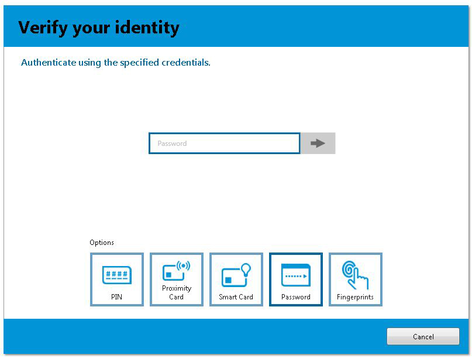

---  
layout: default  
title: Windows Sample Application  
nav_order: 4  
---  

## Windows API Sample Application

The sample application source code is provided in the folder Windows API/C++ and .Net AUTH API (including the Visual Studio 2008 project) from the DigitalPersona API package.
There are two sets of sample code. One for C++ and one for .NET.  

The sample application displays a set of buttons that demonstrate a variety of tasks that you might perform with the DigitalPersona API, such as Authentication, Identification, Working with Secrets and Custom Authentication Policies. When you run the sample application, the main screen looks like one of the images below.
The source code header file, DPAltusAuthSdkApi.h, includes detailed comments describing what each button does.

C++ Sample UI

.NET Sample UI

Note that to run the sample application you must have a DigitalPersona client installed.

For example, to authenticate a user, click on the *Authenticate the currently logged on user* button. A standard DigitalPersona dialog box will appear, similar to the one shown below.

The actual dialog box will vary depending on your environment and the DigitalPersona client that you have installed.
You can authenticate with any method that you have set up. After you authenticate, the result of the operation will appear in the main screen of the sample program as shown below, in this case the message Authentication Succeeded as shown below.

